# miuchi.chat システムアーキテクチャ

## 概要

miuchi.chatは、Rust バックエンドと React フロントエンドで構成された、エンジニア向けリアルタイムチャット・通話アプリケーションです。

## アーキテクチャ概要

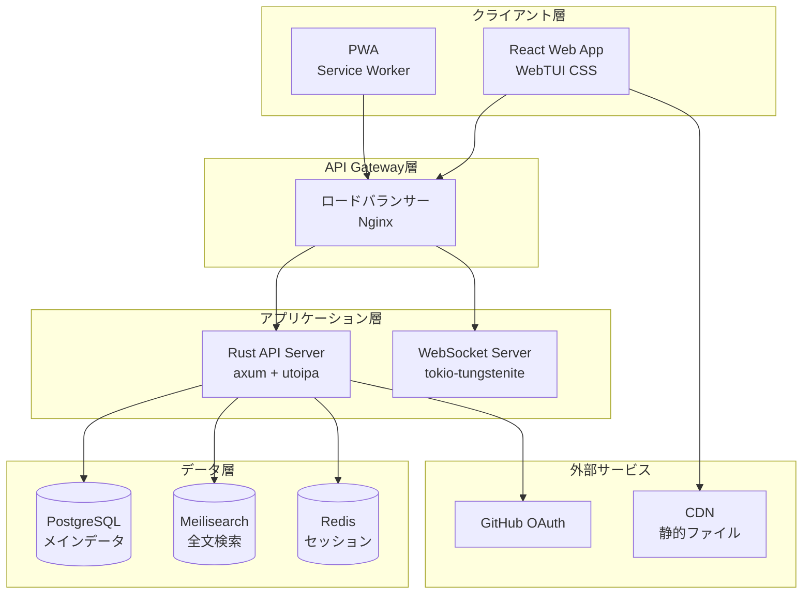

## 技術スタック

### フロントエンド

| 技術 | バージョン | 用途 |
|------|------------|------|
| **React** | 18.3.1 | UIフレームワーク |
| **TypeScript** | 5.8.3 | 型安全性 |
| **Vite** | 7.0.0 | ビルドツール・開発サーバー |
| **WebTUI CSS** | 0.1.2 | ターミナル風デザインシステム |
| **React Router** | 6.26.2 | SPA ルーティング |
| **Axios** | 1.10.0 | HTTP クライアント |

**設計方針:**
- ✅ **Web-TUI スタイル**: ターミナル風のUI/UX
- ✅ **PWA対応**: Service Worker + Manifest
- ✅ **レスポンシブ**: モバイル・デスクトップ対応
- ✅ **TypeScript**: 型安全性重視

### バックエンド

| 技術 | バージョン | 用途 |
|------|------------|------|
| **Rust** | 1.75+ | システムプログラミング言語 |
| **axum** | 0.8 | 非同期Webフレームワーク |
| **tokio** | 1.45 | 非同期ランタイム |
| **sqlx** | 0.8 | 型安全SQLクエリ |
| **utoipa** | 4.2 | OpenAPI文書自動生成 |
| **jsonwebtoken** | 9.3 | JWT認証 |
| **oauth2** | 4.4 | GitHub OAuth |

**設計方針:**
- ✅ **型安全性**: Rustの型システム活用
- ✅ **非同期処理**: tokio-based高性能
- ✅ **API-First**: OpenAPI仕様駆動開発
- ✅ **メモリ安全**: Rustの所有権システム

### データベース・ストレージ

| 技術 | バージョン | 用途 |
|------|------------|------|
| **PostgreSQL** | 16+ | メインデータベース |
| **Meilisearch** | 1.8 | 全文検索エンジン |
| **Redis** | 7+ | セッション・キャッシュ (将来) |

### インフラストラクチャ

| 技術 | 用途 |
|------|------|
| **Docker** | コンテナ化 |
| **Docker Compose** | 開発環境オーケストレーション |
| **Nginx** | リバースプロキシ・静的ファイル配信 |
| **Let's Encrypt** | SSL/TLS証明書 |

## システム構成図

### 開発環境

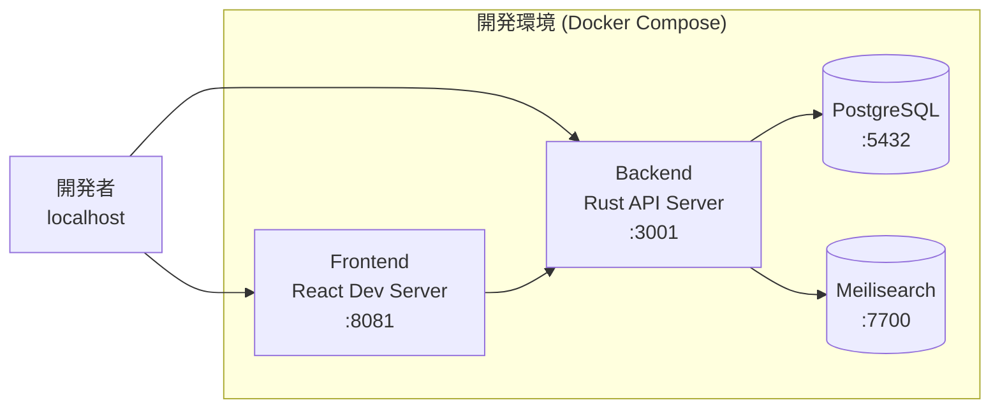

### 本番環境

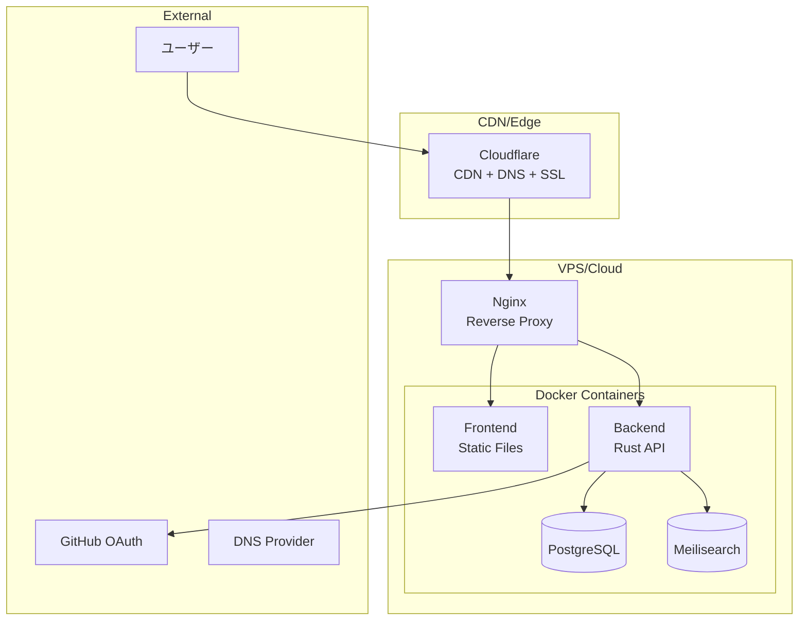

## コンポーネント設計

### フロントエンド アーキテクチャ

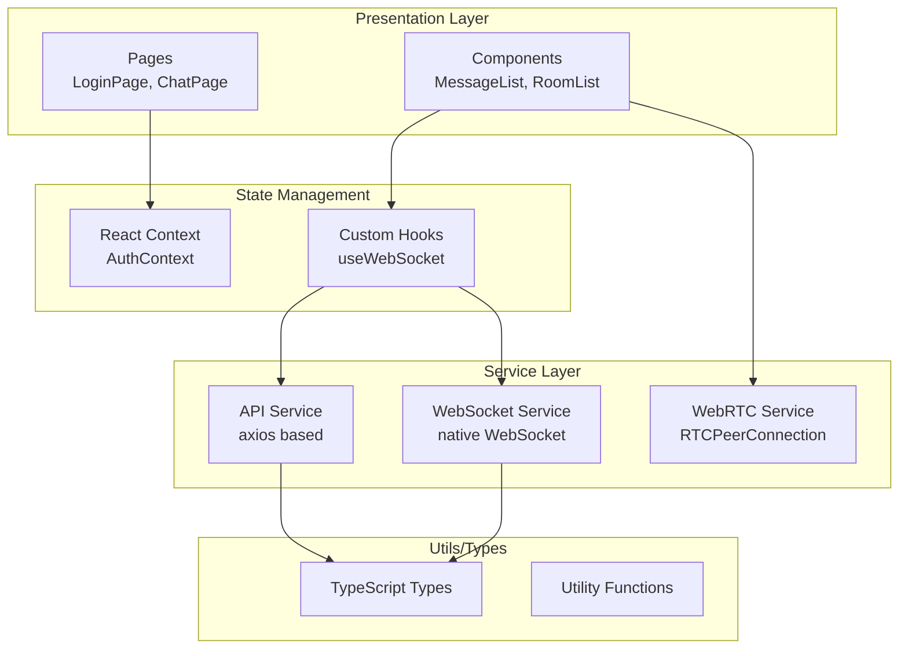

**ディレクトリ構造:**
```
frontend/src/
├── components/           # 再利用可能コンポーネント
│   └── chat/            # チャット関連コンポーネント
├── contexts/            # React Context (状態管理)
├── hooks/               # カスタムフック
├── pages/               # ページコンポーネント
├── services/            # 外部サービス連携
├── types/               # TypeScript型定義
└── utils/               # ユーティリティ関数
```

### バックエンド アーキテクチャ

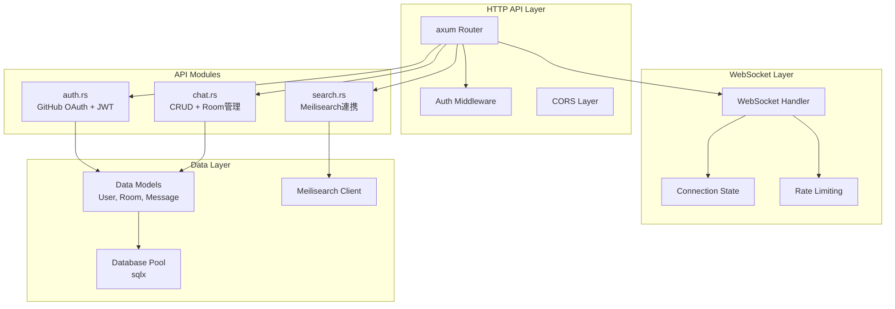

**ディレクトリ構造:**
```
src/
├── main.rs              # アプリケーション エントリーポイント
├── config.rs            # 設定管理
├── api/                 # REST API モジュール
│   ├── mod.rs           # APIルーター
│   ├── auth.rs          # 認証API
│   ├── chat.rs          # チャットAPI
│   └── search.rs        # 検索API
├── models/              # データモデル
│   ├── mod.rs
│   ├── user.rs          # ユーザーモデル
│   ├── room.rs          # ルームモデル
│   └── message.rs       # メッセージモデル
└── ws.rs                # WebSocket ハンドラー
```

## データフロー

### 認証フロー

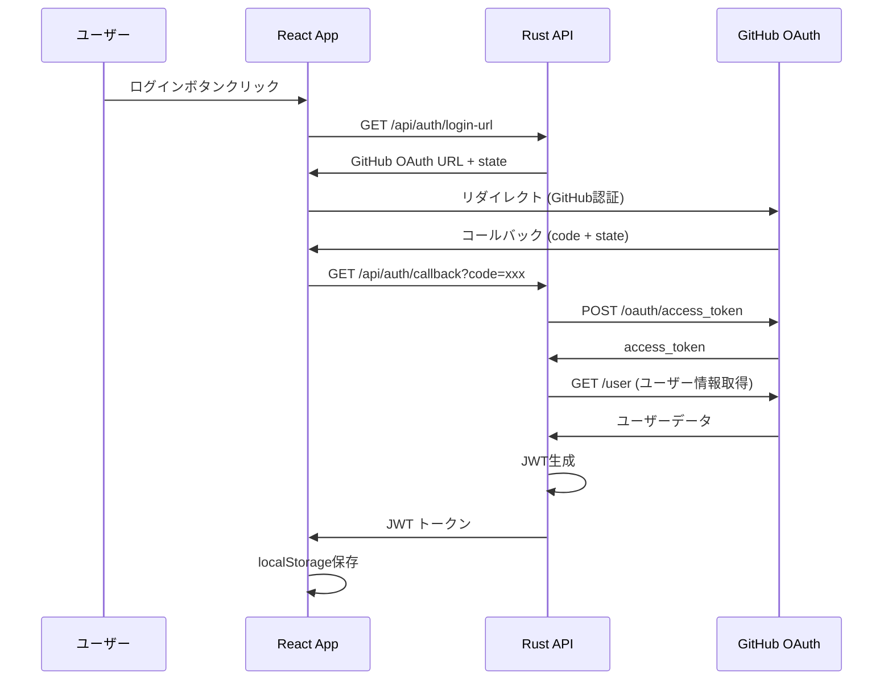

### チャットメッセージフロー

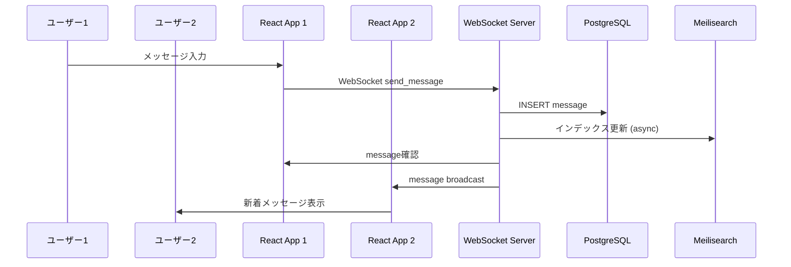

### リアルタイム機能

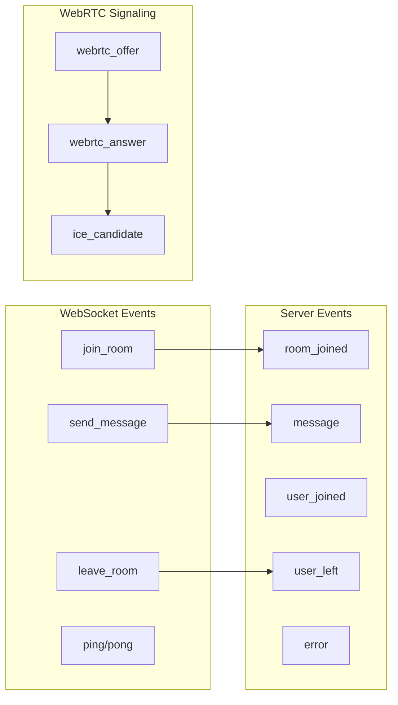

## セキュリティ設計

### 認証・認可

```mermaid
graph TB
    subgraph "認証層"
        JWT[JWT Token<br/>HS256, 24h有効]
        OAuth[GitHub OAuth<br/>Authorization Code Flow]
        Dev[開発認証<br/>DEV_MODE時のみ]
    end
    
    subgraph "認可層"
        Public[パブリックルーム<br/>認証ユーザーのみ]
        Private[プライベートルーム<br/>メンバーのみ]
        Admin[管理機能<br/>ルーム作成者のみ]
    end
    
    subgraph "保護対象"
        API[REST API]
        WS[WebSocket]
        Messages[メッセージ履歴]
    end
    
    OAuth --> JWT
    Dev --> JWT
    JWT --> Public
    JWT --> Private
    JWT --> Admin
    Public --> API
    Private --> WS
    Admin --> Messages
```

### データ保護

| 保護レベル | 対象データ | 実装方法 |
|------------|------------|----------|
| **パブリック** | ユーザー名、アバター | アクセス制限なし |
| **認証必須** | メッセージ履歴 | JWT検証 |
| **メンバー限定** | プライベートルーム | room_members テーブル |
| **暗号化** | JWT payload | HS256 署名 |
| **個人情報** | メールアドレス | NULL許可、オプション |

### セキュリティ実装

```rust
// JWT認証ミドルウェア
#[derive(Debug, Serialize, Deserialize)]
pub struct AuthUser {
    pub id: String,
    pub username: String,
}

// WebSocket認証
pub async fn authenticate_websocket(token: &str) -> Result<AuthUser> {
    let claims = decode_jwt(token)?;
    verify_user_exists(&claims.sub).await?;
    Ok(AuthUser { id: claims.sub, username: claims.username })
}

// ルームアクセス制御
pub async fn check_room_access(user_id: &str, room: &Room, pool: &PgPool) -> Result<bool> {
    if room.is_public {
        return Ok(true);
    }
    
    let is_member = sqlx::query!(
        "SELECT 1 FROM room_members WHERE user_id = $1 AND room_id = $2",
        user_id, room.id
    )
    .fetch_optional(pool)
    .await?
    .is_some();
    
    Ok(is_member)
}
```

## パフォーマンス設計

### スケーラビリティ

| コンポーネント | ボトルネック | 対策 |
|----------------|--------------|------|
| **WebSocket** | 接続数制限 | 接続プール + 水平スケール |
| **PostgreSQL** | 同時接続数 | コネクションプール (sqlx) |
| **Meilisearch** | インデックス更新 | 非同期バッチ処理 |
| **静的ファイル** | 転送量 | CDN (Cloudflare) |

### キャッシュ戦略

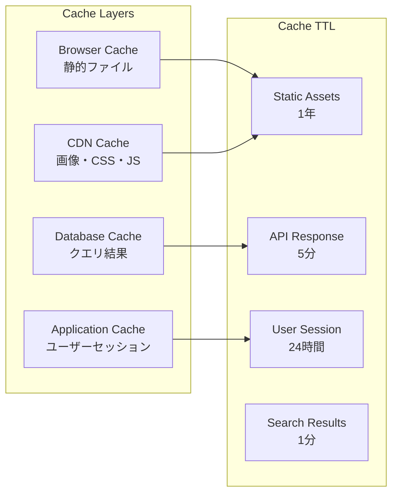

### 監視・メトリクス

```rust
// パフォーマンス監視例
#[derive(Debug)]
pub struct Metrics {
    pub websocket_connections: AtomicU64,
    pub messages_per_second: AtomicU64,
    pub database_query_time: Histogram,
    pub search_query_time: Histogram,
}

// ヘルスチェック
pub async fn health_check(State(pool): State<PgPool>) -> Json<Value> {
    let db_status = match sqlx::query("SELECT 1").execute(&pool).await {
        Ok(_) => "healthy",
        Err(_) => "unhealthy",
    };
    
    json!({
        "status": "healthy",
        "database": db_status,
        "timestamp": Utc::now(),
        "version": env!("CARGO_PKG_VERSION")
    })
}
```

## 開発・デプロイ戦略

### 開発環境

```yaml
# docker-compose.yml (開発用)
version: '3.8'
services:
  backend:
    build: 
      context: .
      dockerfile: Dockerfile.backend
    ports:
      - "3001:3000"
    environment:
      - DEV_MODE=true
      - RUST_LOG=debug
    volumes:
      - ./src:/app/src
      - ./Cargo.toml:/app/Cargo.toml
  
  frontend:
    build:
      context: ./frontend
      dockerfile: ../Dockerfile.frontend
    ports:
      - "8081:8080"
    volumes:
      - ./frontend/src:/app/src
  
  postgres:
    image: postgres:16
    environment:
      POSTGRES_DB: miuchi_chat
      POSTGRES_USER: postgres
      POSTGRES_PASSWORD: password
    ports:
      - "5432:5432"
  
  meilisearch:
    image: getmeili/meilisearch:v1.8
    ports:
      - "7700:7700"
```

### CI/CD パイプライン

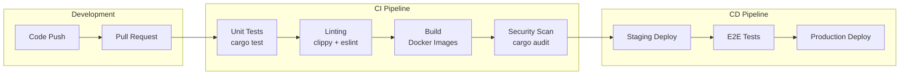

### デプロイ構成

| 環境 | 構成 | 用途 |
|------|------|------|
| **開発** | Docker Compose | ローカル開発 |
| **ステージング** | VPS + Docker | テスト・検証 |
| **本番** | VPS/Cloud + Docker | 本番運用 |

## 品質保証

### テスト戦略

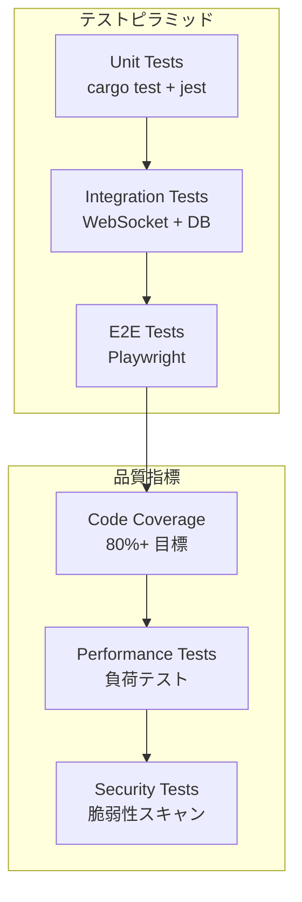

### 品質ゲート

| フェーズ | チェック項目 | 自動化 |
|----------|--------------|--------|
| **コミット** | Unit Tests, Linting | ✅ |
| **PR** | Integration Tests, Type Check | ✅ |
| **マージ** | Security Scan, Build | ✅ |
| **デプロイ** | E2E Tests, Performance | ✅ |

## 今後の拡張計画

### フェーズ2: 通話機能強化
- 画面共有機能
- 通話録音・再生
- 複数人通話対応

### フェーズ3: エンジニア機能
- LaTeX数式レンダリング
- シンタックスハイライト
- コードスニペット共有

### フェーズ4: エンタープライズ
- SSO認証対応
- 監査ログ
- データ保持ポリシー

---

**更新日**: 2025-01-12  
**バージョン**: v1.0  
**作成者**: miuchi.chat開発チーム