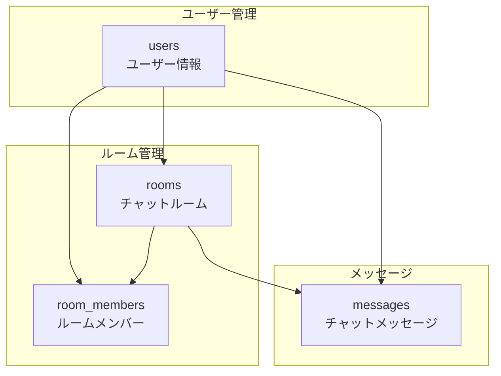
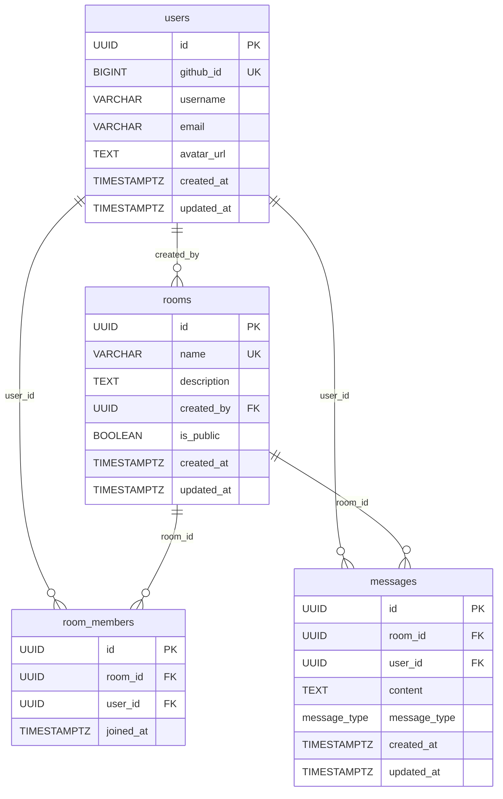

# miuchi.chat データベース設計

## 概要

miuchi.chatアプリケーションは PostgreSQL を使用し、チャット、ユーザー管理、ルーム管理の機能を提供します。

## データベース情報

| 項目 | 値 |
|------|---|
| DBMS | PostgreSQL 16+ |
| 文字セット | UTF-8 |
| タイムゾーン | UTC |
| 識別子 | UUID (gen_random_uuid()) |

## データモデル概要



## テーブル設計

### 1. users (ユーザー)

GitHub OAuth認証によるユーザー情報を管理

| カラム名 | 型 | 制約 | 説明 |
|---------|-----|------|------|
| id | UUID | PRIMARY KEY, DEFAULT gen_random_uuid() | ユーザーID |
| github_id | BIGINT | UNIQUE, NOT NULL | GitHub ユーザーID |
| username | VARCHAR(100) | NOT NULL | GitHub ユーザー名 |
| email | VARCHAR(255) | NULL | メールアドレス |
| avatar_url | TEXT | NULL | アバター画像URL |
| created_at | TIMESTAMPTZ | NOT NULL, DEFAULT now() | 作成日時 |
| updated_at | TIMESTAMPTZ | NOT NULL, DEFAULT now() | 更新日時 |

**インデックス:**
- `idx_users_github_id` ON (github_id) - OAuth認証用

**制約:**
- UNIQUE(github_id) - 1つのGitHubアカウントに1ユーザー

```sql
CREATE TABLE users (
    id UUID PRIMARY KEY DEFAULT gen_random_uuid(),
    github_id BIGINT UNIQUE NOT NULL,
    username VARCHAR(100) NOT NULL,
    email VARCHAR(255),
    avatar_url TEXT,
    created_at TIMESTAMPTZ NOT NULL DEFAULT now(),
    updated_at TIMESTAMPTZ NOT NULL DEFAULT now()
);
```

### 2. rooms (チャットルーム)

パブリック/プライベートのチャットルームを管理

| カラム名 | 型 | 制約 | 説明 |
|---------|-----|------|------|
| id | UUID | PRIMARY KEY, DEFAULT gen_random_uuid() | ルームID |
| name | VARCHAR(100) | NOT NULL, UNIQUE | ルーム名 |
| description | TEXT | NULL | ルームの説明 |
| created_by | UUID | NOT NULL, REFERENCES users(id) | 作成者ID |
| is_public | BOOLEAN | NOT NULL, DEFAULT false | パブリック/プライベート |
| created_at | TIMESTAMPTZ | NOT NULL, DEFAULT now() | 作成日時 |
| updated_at | TIMESTAMPTZ | NOT NULL, DEFAULT now() | 更新日時 |

**インデックス:**
- `idx_rooms_name` ON (name) - ルーム名検索用

**制約:**
- UNIQUE(name) - ルーム名は一意
- FOREIGN KEY(created_by) REFERENCES users(id)

```sql
CREATE TABLE rooms (
    id UUID PRIMARY KEY DEFAULT gen_random_uuid(),
    name VARCHAR(100) NOT NULL UNIQUE,
    description TEXT,
    created_by UUID NOT NULL REFERENCES users(id),
    is_public BOOLEAN NOT NULL DEFAULT false,
    created_at TIMESTAMPTZ NOT NULL DEFAULT now(),
    updated_at TIMESTAMPTZ NOT NULL DEFAULT now()
);
```

### 3. room_members (ルームメンバー)

プライベートルームのメンバーシップを管理

| カラム名 | 型 | 制約 | 説明 |
|---------|-----|------|------|
| id | UUID | PRIMARY KEY, DEFAULT gen_random_uuid() | メンバーシップID |
| room_id | UUID | NOT NULL, REFERENCES rooms(id) ON DELETE CASCADE | ルームID |
| user_id | UUID | NOT NULL, REFERENCES users(id) ON DELETE CASCADE | ユーザーID |
| joined_at | TIMESTAMPTZ | NOT NULL, DEFAULT now() | 参加日時 |

**インデックス:**
- `idx_room_members_room_id` ON (room_id)
- `idx_room_members_user_id` ON (user_id)

**制約:**
- UNIQUE(room_id, user_id) - 1ユーザー1ルーム1メンバーシップ
- FOREIGN KEY(room_id) REFERENCES rooms(id) ON DELETE CASCADE
- FOREIGN KEY(user_id) REFERENCES users(id) ON DELETE CASCADE

```sql
CREATE TABLE room_members (
    id UUID PRIMARY KEY DEFAULT gen_random_uuid(),
    room_id UUID NOT NULL REFERENCES rooms(id) ON DELETE CASCADE,
    user_id UUID NOT NULL REFERENCES users(id) ON DELETE CASCADE,
    joined_at TIMESTAMPTZ NOT NULL DEFAULT now(),
    UNIQUE(room_id, user_id)
);
```

### 4. messages (チャットメッセージ)

チャットメッセージとMeilisearch連携

| カラム名 | 型 | 制約 | 説明 |
|---------|-----|------|------|
| id | UUID | PRIMARY KEY, DEFAULT gen_random_uuid() | メッセージID |
| room_id | UUID | NOT NULL, REFERENCES rooms(id) ON DELETE CASCADE | ルームID |
| user_id | UUID | NOT NULL, REFERENCES users(id) | 送信者ID |
| content | TEXT | NOT NULL | メッセージ内容 |
| message_type | message_type | NOT NULL, DEFAULT 'text' | メッセージタイプ |
| created_at | TIMESTAMPTZ | NOT NULL, DEFAULT now() | 作成日時 |
| updated_at | TIMESTAMPTZ | NOT NULL, DEFAULT now() | 更新日時 |

**ENUMタイプ:**
```sql
CREATE TYPE message_type AS ENUM ('text', 'image', 'file', 'system');
```

**インデックス:**
- `idx_messages_room_id` ON (room_id) - ルーム別メッセージ取得
- `idx_messages_user_id` ON (user_id) - ユーザー別メッセージ取得
- `idx_messages_created_at` ON (created_at DESC) - 時系列ソート
- `idx_messages_room_created_at` ON (room_id, created_at DESC) - ルーム内時系列

**制約:**
- FOREIGN KEY(room_id) REFERENCES rooms(id) ON DELETE CASCADE
- FOREIGN KEY(user_id) REFERENCES users(id)

```sql
CREATE TABLE messages (
    id UUID PRIMARY KEY DEFAULT gen_random_uuid(),
    room_id UUID NOT NULL REFERENCES rooms(id) ON DELETE CASCADE,
    user_id UUID NOT NULL REFERENCES users(id),
    content TEXT NOT NULL,
    message_type message_type NOT NULL DEFAULT 'text',
    created_at TIMESTAMPTZ NOT NULL DEFAULT now(),
    updated_at TIMESTAMPTZ NOT NULL DEFAULT now()
);
```

## リレーション図



## ビジネスルール

### アクセス制御

#### パブリックルーム
- **参加**: 認証されたユーザーなら誰でも参加可能
- **メッセージ送信**: 参加者なら誰でも送信可能
- **メンバー管理**: 不要（`room_members`テーブル使用しない）

#### プライベートルーム
- **参加**: `room_members`テーブルに登録されたユーザーのみ
- **メッセージ送信**: メンバーのみ送信可能
- **招待**: 既存メンバーが新しいユーザーを招待可能

### デフォルトルーム
- `general`: パブリックルーム、全ユーザーが最初に参加
- `random`: パブリックルーム、雑談用

### データ制約

#### メッセージ制限
- 最大長: 10,000文字
- タイプ: text, image, file, system

#### ルーム制限
- 名前: 英数字、ハイフン、アンダースコアのみ
- 最大長: 100文字
- 重複不可

## インデックス戦略

### パフォーマンス最適化

```sql
-- メッセージ履歴取得（ページネーション対応）
CREATE INDEX idx_messages_room_created_at ON messages(room_id, created_at DESC);

-- ユーザー検索（OAuth認証）
CREATE INDEX idx_users_github_id ON users(github_id);

-- ルーム検索
CREATE INDEX idx_rooms_name ON rooms(name);

-- メンバーシップ確認
CREATE INDEX idx_room_members_user_room ON room_members(user_id, room_id);
```

### 検索最適化

Meilisearchと併用して全文検索をサポート：

```sql
-- メッセージ検索バックアップ用（PostgreSQL FTS）
CREATE INDEX idx_messages_content_fts ON messages 
USING gin(to_tsvector('english', content));
```

## トリガー・関数

### 自動タイムスタンプ更新

```sql
-- 汎用updated_at更新関数
CREATE OR REPLACE FUNCTION update_updated_at_column()
RETURNS TRIGGER AS $$
BEGIN
    NEW.updated_at = now();
    RETURN NEW;
END;
$$ language 'plpgsql';

-- 各テーブルにトリガー設定
CREATE TRIGGER update_users_updated_at 
    BEFORE UPDATE ON users
    FOR EACH ROW EXECUTE FUNCTION update_updated_at_column();

CREATE TRIGGER update_rooms_updated_at 
    BEFORE UPDATE ON rooms
    FOR EACH ROW EXECUTE FUNCTION update_updated_at_column();

CREATE TRIGGER update_messages_updated_at 
    BEFORE UPDATE ON messages
    FOR EACH ROW EXECUTE FUNCTION update_updated_at_column();
```

## マイグレーション履歴

| バージョン | ファイル | 説明 |
|------------|----------|------|
| 001 | create_users_table.sql | ユーザーテーブル作成 |
| 002 | create_rooms_table.sql | ルームテーブル作成 |
| 003 | create_messages_table.sql | メッセージテーブル・ENUMタイプ作成 |
| 004 | create_room_members_table.sql | ルームメンバーテーブル作成 |
| 005 | insert_default_data.sql | デフォルトデータ挿入 |
| 006 | add_is_public_to_rooms.sql | パブリック/プライベートフラグ追加 |
| 007 | remove_default_data.sql | デフォルトデータ削除（動的作成に変更） |

## パフォーマンス考慮事項

### 負荷分散

1. **読み取り最適化**
   - メッセージ履歴: `(room_id, created_at DESC)` 複合インデックス
   - ユーザー検索: `github_id` インデックス

2. **書き込み最適化**
   - バッチメッセージ挿入（WebSocket経由）
   - 非同期Meilisearchインデックス更新

3. **ストレージ最適化**
   - 古いメッセージのアーカイブ化（将来実装）
   - 画像/ファイルの外部ストレージ使用（S3等）

### 監視ポイント

```sql
-- よく使用されるクエリの性能確認
EXPLAIN ANALYZE SELECT * FROM messages 
WHERE room_id = $1 
ORDER BY created_at DESC 
LIMIT 50;

-- インデックス使用状況
SELECT schemaname, tablename, attname, n_distinct, correlation 
FROM pg_stats 
WHERE tablename IN ('users', 'rooms', 'messages', 'room_members');
```

## セキュリティ考慮事項

### データ保護

1. **個人情報**
   - `users.email`: NULL許可（オプション）
   - `users.avatar_url`: GitHub提供URLのみ

2. **アクセス制御**
   - Row Level Security (RLS) 将来実装予定
   - アプリケーションレベルでの権限チェック

3. **データ整合性**
   - 外部キー制約による参照整合性
   - カスケード削除による一貫性保証

### バックアップ戦略

```bash
# 日次バックアップ
pg_dump -h localhost -U miuchi_user miuchi_chat > backup_$(date +%Y%m%d).sql

# ポイントインタイム リカバリ用WALアーカイブ
# postgresql.conf で archive_mode = on
```

## 将来拡張

### 通話機能対応

```sql
-- 将来実装予定: 通話セッション管理
CREATE TABLE call_sessions (
    id UUID PRIMARY KEY DEFAULT gen_random_uuid(),
    room_id UUID NOT NULL REFERENCES rooms(id),
    initiated_by UUID NOT NULL REFERENCES users(id),
    status VARCHAR(20) DEFAULT 'active',
    started_at TIMESTAMPTZ NOT NULL DEFAULT now(),
    ended_at TIMESTAMPTZ
);

CREATE TABLE call_participants (
    id UUID PRIMARY KEY DEFAULT gen_random_uuid(),
    session_id UUID NOT NULL REFERENCES call_sessions(id),
    user_id UUID NOT NULL REFERENCES users(id),
    joined_at TIMESTAMPTZ NOT NULL DEFAULT now(),
    left_at TIMESTAMPTZ
);
```

### 監査ログ

```sql
-- 将来実装予定: ユーザー操作ログ
CREATE TABLE audit_log (
    id UUID PRIMARY KEY DEFAULT gen_random_uuid(),
    user_id UUID REFERENCES users(id),
    action VARCHAR(50) NOT NULL,
    resource_type VARCHAR(50),
    resource_id UUID,
    details JSONB,
    timestamp TIMESTAMPTZ NOT NULL DEFAULT now()
);
```

---

**更新日**: 2025-01-12  
**バージョン**: v1.0  
**作成者**: miuchi.chat開発チーム