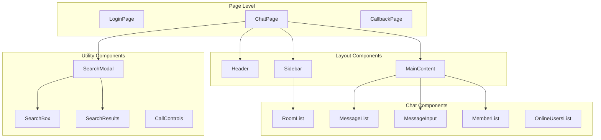

# miuchi.chat 実装ガイド

## 概要

このドキュメントでは、miuchi.chatの具体的な実装詳細、コンポーネント設計、状態管理、WebSocket通信などの技術的実装について詳述します。

## フロントエンド実装

### React コンポーネント設計

#### 設計原則

1. **単一責任の原則**: 各コンポーネントは1つの明確な責任を持つ
2. **再利用性**: 汎用的なコンポーネントは他の部分で再利用可能
3. **型安全性**: TypeScriptによる厳密な型定義
4. **WebTUIスタイル**: ターミナル風デザインの一貫性

#### コンポーネント階層



### 主要コンポーネント詳細

#### 1. ChatPage.tsx - メインページ

**責任**: チャット機能の統合・状態管理・レイアウト

```typescript
interface ChatPageState {
  currentRoom: Room | null;
  showMemberList: boolean;
  showSearchModal: boolean;
  onlineUsers: OnlineUser[];
}

export default function ChatPage() {
  const { user, token } = useAuth();
  const [state, setState] = useState<ChatPageState>({
    currentRoom: null,
    showMemberList: false,
    showSearchModal: false,
    onlineUsers: []
  });

  // WebSocket接続とメッセージ処理
  const { connectionStatus, sendMessage, joinRoom } = useWebSocket({
    roomId: state.currentRoom?.name,
    onMessage: handleNewMessage,
    onError: handleWebSocketError
  });

  // ルーム変更処理
  const handleRoomChange = useCallback((room: Room) => {
    if (state.currentRoom) {
      leaveRoom(state.currentRoom.name);
    }
    setState(prev => ({ ...prev, currentRoom: room }));
    joinRoom(room.name);
  }, [state.currentRoom, joinRoom, leaveRoom]);

  return (
    <div className="chat-page">
      <Sidebar 
        currentRoom={state.currentRoom}
        onRoomChange={handleRoomChange}
      />
      <MainContent 
        room={state.currentRoom}
        connectionStatus={connectionStatus}
        onSendMessage={sendMessage}
      />
      {state.showMemberList && (
        <MemberList 
          room={state.currentRoom}
          isVisible={state.showMemberList}
          onClose={() => setState(prev => ({ ...prev, showMemberList: false }))}
        />
      )}
    </div>
  );
}
```

#### 2. useWebSocket.ts - WebSocket状態管理

**責任**: WebSocket接続・メッセージ送受信・接続状態管理

```typescript
interface UseWebSocketOptions {
  roomId?: string;
  onMessage?: (message: Message) => void;
  onRoomCreated?: (room: Room) => void;
  onError?: (error: Error) => void;
}

interface UseWebSocketReturn {
  connectionStatus: ConnectionStatus;
  sendMessage: (content: string) => void;
  joinRoom: (roomId: string) => void;
  leaveRoom: (roomId: string) => void;
}

export function useWebSocket(options: UseWebSocketOptions): UseWebSocketReturn {
  const [connectionStatus, setConnectionStatus] = useState<ConnectionStatus>('disconnected');
  const onMessageRef = useRef(options.onMessage);
  const onErrorRef = useRef(options.onError);

  // WebSocket接続管理
  useEffect(() => {
    const token = localStorage.getItem('token');
    if (!token) return;

    // WebSocketサービスの接続状態監視
    const unsubscribeState = wsService.onConnectionStateChange(setConnectionStatus);
    
    // メッセージハンドラー登録
    const unsubscribeMessage = wsService.onMessage(handleMessage);

    // 接続開始
    wsService.connect(token);

    return () => {
      unsubscribeState();
      unsubscribeMessage();
      wsService.disconnect();
    };
  }, []);

  // メッセージ処理
  const handleMessage = useCallback((message: WsMessage) => {
    switch (message.type) {
      case 'message':
        if (onMessageRef.current) {
          const msg: Message = {
            id: message.id,
            room_id: message.room,
            author_id: message.user_id,
            author_name: message.username,
            content: message.content,
            message_type: message.message_type,
            created_at: message.timestamp
          };
          onMessageRef.current(msg);
        }
        break;
      case 'error':
        if (onErrorRef.current) {
          onErrorRef.current(new Error(message.message));
        }
        break;
    }
  }, []);

  return {
    connectionStatus,
    sendMessage: (content: string) => wsService.sendMessage(content),
    joinRoom: (roomId: string) => wsService.joinRoom(roomId),
    leaveRoom: (roomId: string) => wsService.leaveRoom(roomId)
  };
}
```

#### 3. MessageList.tsx - メッセージ表示

**責任**: メッセージ履歴表示・自動スクロール・仮想化

```typescript
interface MessageListProps {
  room: Room | null;
  className?: string;
}

export default function MessageList({ room, className }: MessageListProps) {
  const [messages, setMessages] = useState<Message[]>([]);
  const [loading, setLoading] = useState(false);
  const [hasMore, setHasMore] = useState(true);
  const messagesEndRef = useRef<HTMLDivElement>(null);

  // メッセージ履歴取得
  const loadMessages = useCallback(async (before?: string) => {
    if (!room || loading) return;

    setLoading(true);
    try {
      const response = await api.getMessages(room.name, { 
        limit: 50, 
        before 
      });
      
      if (before) {
        setMessages(prev => [...response.messages, ...prev]);
      } else {
        setMessages(response.messages);
        scrollToBottom();
      }
      
      setHasMore(response.has_more);
    } catch (error) {
      console.error('Failed to load messages:', error);
    } finally {
      setLoading(false);
    }
  }, [room, loading]);

  // 新着メッセージの追加
  const addMessage = useCallback((message: Message) => {
    setMessages(prev => [...prev, message]);
    scrollToBottom();
  }, []);

  // 自動スクロール
  const scrollToBottom = () => {
    messagesEndRef.current?.scrollIntoView({ 
      behavior: 'smooth' 
    });
  };

  // ルーム変更時の処理
  useEffect(() => {
    if (room) {
      setMessages([]);
      loadMessages();
    }
  }, [room, loadMessages]);

  return (
    <div className={`message-list ${className || ''}`}>
      {hasMore && (
        <button 
          onClick={() => loadMessages(messages[0]?.id)}
          disabled={loading}
        >
          {loading ? '読込中...' : '過去のメッセージを読み込む'}
        </button>
      )}
      
      <div className="messages-container">
        {messages.map(message => (
          <MessageItem 
            key={message.id} 
            message={message} 
          />
        ))}
        <div ref={messagesEndRef} />
      </div>
    </div>
  );
}
```

### 状態管理アーキテクチャ

#### React Context パターン

```typescript
// AuthContext.tsx
interface AuthContextType {
  user: User | null;
  token: string | null;
  login: (token: string) => void;
  logout: () => void;
  setUser: (user: User | null) => void;
  setToken: (token: string) => void;
}

export const AuthContext = createContext<AuthContextType | null>(null);

export function AuthProvider({ children }: { children: ReactNode }) {
  const [user, setUser] = useState<User | null>(null);
  const [token, setToken] = useState<string | null>(
    localStorage.getItem('token')
  );

  const login = useCallback((newToken: string) => {
    setToken(newToken);
    localStorage.setItem('token', newToken);
  }, []);

  const logout = useCallback(() => {
    setUser(null);
    setToken(null);
    localStorage.removeItem('token');
  }, []);

  // トークンからユーザー情報を取得
  useEffect(() => {
    if (token && !user) {
      api.getCurrentUser()
        .then(setUser)
        .catch(() => logout());
    }
  }, [token, user, logout]);

  return (
    <AuthContext.Provider value={{
      user,
      token,
      login,
      logout,
      setUser,
      setToken
    }}>
      {children}
    </AuthContext.Provider>
  );
}

export function useAuth() {
  const context = useContext(AuthContext);
  if (!context) {
    throw new Error('useAuth must be used within AuthProvider');
  }
  return context;
}
```

#### ローカル状態管理パターン

```typescript
// カスタムフック: useRoom
export function useRoom(roomName?: string) {
  const [room, setRoom] = useState<Room | null>(null);
  const [loading, setLoading] = useState(false);
  const [error, setError] = useState<string | null>(null);

  const loadRoom = useCallback(async (name: string) => {
    setLoading(true);
    setError(null);
    
    try {
      const rooms = await api.getRooms();
      const targetRoom = rooms.rooms.find(r => r.name === name);
      
      if (targetRoom) {
        setRoom(targetRoom);
      } else {
        setError(`Room '${name}' not found`);
      }
    } catch (err) {
      setError(err instanceof Error ? err.message : 'Unknown error');
    } finally {
      setLoading(false);
    }
  }, []);

  useEffect(() => {
    if (roomName) {
      loadRoom(roomName);
    }
  }, [roomName, loadRoom]);

  return { room, loading, error, refetch: () => roomName && loadRoom(roomName) };
}
```

## バックエンド実装

### Rust API 実装

#### API構造

```rust
// main.rs - アプリケーション設定
#[tokio::main]
async fn main() -> anyhow::Result<()> {
    // 環境変数読み込み
    dotenvy::dotenv().ok();
    
    // トレーシング設定
    tracing_subscriber::registry()
        .with(tracing_subscriber::EnvFilter::try_from_default_env()?)
        .with(tracing_subscriber::fmt::layer())
        .init();

    // データベース接続
    let database_url = std::env::var("DATABASE_URL")?;
    let pool = PgPool::connect(&database_url).await?;
    
    // Meilisearch クライアント
    let meili_client = initialize_meilisearch().await?;
    
    // WebSocket状態管理
    let ws_state: ws::AppState = Arc::new(RwLock::new(HashMap::new()));
    
    // ルーター構築
    let app = Router::new()
        .route("/", get(root))
        .route("/health", get(health_check))
        .nest("/api", api::create_router())
        .route("/ws", get(ws::websocket_handler))
        .with_state((pool, ws_state, meili_client))
        .layer(CorsLayer::permissive());

    // サーバー起動
    let listener = tokio::net::TcpListener::bind("0.0.0.0:3000").await?;
    axum::serve(listener, app).await?;
    
    Ok(())
}
```

#### 認証ミドルウェア

```rust
// api/auth.rs
use axum::{
    extract::{FromRequestParts, Query, State},
    http::{request::Parts, StatusCode},
    response::Json,
};

#[derive(Debug, Serialize, Deserialize)]
pub struct AuthUser {
    pub id: String,
    pub username: String,
    pub email: Option<String>,
}

#[async_trait]
impl<S> FromRequestParts<S> for AuthUser
where
    S: Send + Sync,
{
    type Rejection = StatusCode;

    async fn from_request_parts(parts: &mut Parts, _state: &S) -> Result<Self, Self::Rejection> {
        let auth_header = parts
            .headers
            .get("authorization")
            .and_then(|header| header.to_str().ok())
            .and_then(|header| header.strip_prefix("Bearer "))
            .ok_or(StatusCode::UNAUTHORIZED)?;

        verify_jwt(auth_header)
            .map_err(|_| StatusCode::UNAUTHORIZED)
    }
}

pub fn verify_jwt(token: &str) -> Result<AuthUser, jsonwebtoken::errors::Error> {
    let secret = std::env::var("JWT_SECRET").unwrap_or_else(|_| "default_secret".to_string());
    let key = DecodingKey::from_secret(secret.as_bytes());
    let validation = Validation::new(Algorithm::HS256);

    let token_data = decode::<Claims>(token, &key, &validation)?;
    
    Ok(AuthUser {
        id: token_data.claims.sub,
        username: token_data.claims.username,
        email: token_data.claims.email,
    })
}
```

#### チャットAPI実装

```rust
// api/chat.rs
#[utoipa::path(
    get,
    path = "/api/chat/{room}/messages",
    params(
        ("room" = String, Path, description = "Room name"),
        ("limit" = Option<i64>, Query, description = "Number of messages to retrieve"),
        ("before" = Option<String>, Query, description = "Message ID to fetch before")
    ),
    responses(
        (status = 200, description = "Messages retrieved successfully", body = MessagesResponse),
        (status = 401, description = "Unauthorized"),
        (status = 404, description = "Room not found")
    ),
    security(("bearer_auth" = []))
)]
pub async fn get_messages(
    Path(room_name): Path<String>,
    Query(params): Query<GetMessagesParams>,
    State((pool, _)): State<(PgPool, meilisearch_sdk::client::Client)>,
    auth_user: AuthUser,
) -> Result<Json<MessagesResponse>, StatusCode> {
    // ルーム存在確認
    let room = get_room_by_name(&pool, &room_name).await
        .map_err(|_| StatusCode::NOT_FOUND)?;

    // アクセス権限確認
    if !room.is_public && !is_room_member(&pool, &auth_user.id, &room.id).await? {
        return Err(StatusCode::FORBIDDEN);
    }

    // メッセージ取得
    let limit = params.limit.unwrap_or(50).min(100);
    let messages = if let Some(before_id) = params.before {
        get_messages_before(&pool, &room.id, &before_id, limit).await?
    } else {
        get_latest_messages(&pool, &room.id, limit).await?
    };

    let has_more = messages.len() == limit as usize;
    let total = count_room_messages(&pool, &room.id).await?;

    Ok(Json(MessagesResponse {
        messages,
        total,
        has_more,
    }))
}

pub async fn send_message(
    Path(room_name): Path<String>,
    State((pool, meili_client)): State<(PgPool, meilisearch_sdk::client::Client)>,
    auth_user: AuthUser,
    Json(request): Json<SendMessageRequest>,
) -> Result<Json<SendMessageResponse>, StatusCode> {
    // ルーム確認とアクセス権限チェック
    let room = get_room_by_name(&pool, &room_name).await
        .map_err(|_| StatusCode::NOT_FOUND)?;

    if !room.is_public && !is_room_member(&pool, &auth_user.id, &room.id).await? {
        return Err(StatusCode::FORBIDDEN);
    }

    // メッセージ保存
    let message_id = Uuid::new_v4();
    let now = Utc::now();

    sqlx::query!(
        r#"
        INSERT INTO messages (id, room_id, user_id, content, message_type, created_at)
        VALUES ($1, $2, $3, $4, $5, $6)
        "#,
        message_id,
        room.id,
        Uuid::parse_str(&auth_user.id).map_err(|_| StatusCode::BAD_REQUEST)?,
        request.content,
        request.message_type.unwrap_or("text".to_string()) as _,
        now
    )
    .execute(&pool)
    .await
    .map_err(|_| StatusCode::INTERNAL_SERVER_ERROR)?;

    // Meilisearch インデックス更新（非同期）
    tokio::spawn(async move {
        let _ = update_search_index(&meili_client, &message_id.to_string(), &request.content).await;
    });

    Ok(Json(SendMessageResponse {
        id: message_id.to_string(),
        timestamp: now,
    }))
}
```

### WebSocket実装

#### WebSocket メッセージ定義

```rust
// ws.rs
#[derive(Debug, Clone, Serialize, Deserialize)]
#[serde(tag = "type")]
pub enum WsMessage {
    // クライアント→サーバー
    #[serde(rename = "join_room")]
    JoinRoom { room: String },
    
    #[serde(rename = "send_message")]
    SendMessage {
        room: String,
        content: String,
        message_type: Option<String>,
    },
    
    #[serde(rename = "leave_room")]
    LeaveRoom { room: String },
    
    #[serde(rename = "ping")]
    Ping { timestamp: Option<u64> },

    // サーバー→クライアント
    #[serde(rename = "room_joined")]
    RoomJoined {
        room: String,
        user_id: String,
        username: String,
    },
    
    #[serde(rename = "message")]
    Message {
        id: String,
        room: String,
        user_id: String,
        username: String,
        content: String,
        message_type: String,
        timestamp: DateTime<Utc>,
    },
    
    #[serde(rename = "error")]
    Error { message: String, code: Option<u16> },
    
    #[serde(rename = "pong")]
    Pong { timestamp: Option<u64> },
}
```

#### WebSocket接続管理

```rust
pub struct Client {
    pub id: String,
    pub user_id: String,
    pub username: String,
    pub rooms: HashSet<String>,
    pub sender: mpsc::UnboundedSender<Result<Message, axum::Error>>,
    pub last_pong: Instant,
    pub rate_limiter: RateLimiter,
}

pub type AppState = Arc<RwLock<HashMap<String, Client>>>;

pub async fn websocket_handler(
    ws: WebSocketUpgrade,
    Query(params): Query<WsConnectParams>,
    State((pool, state, meili_client)): State<(PgPool, AppState, meilisearch_sdk::client::Client)>,
) -> Response {
    // JWT認証
    let auth_user = match verify_jwt(&params.token) {
        Ok(user) => user,
        Err(_) => {
            return (StatusCode::UNAUTHORIZED, "Invalid token").into_response();
        }
    };

    ws.on_upgrade(move |socket| {
        handle_websocket(socket, auth_user, pool, state, meili_client)
    })
}

async fn handle_websocket(
    socket: WebSocket,
    auth_user: AuthUser,
    pool: PgPool,
    state: AppState,
    meili_client: meilisearch_sdk::client::Client,
) {
    let (mut sender, mut receiver) = socket.split();
    let (tx, mut rx) = mpsc::unbounded_channel::<Result<Message, axum::Error>>();

    let client_id = Uuid::new_v4().to_string();
    let client = Client {
        id: client_id.clone(),
        user_id: auth_user.id.clone(),
        username: auth_user.username.clone(),
        rooms: HashSet::new(),
        sender: tx,
        last_pong: Instant::now(),
        rate_limiter: RateLimiter::new(),
    };

    // クライアント登録
    {
        let mut clients = state.write().await;
        clients.insert(client_id.clone(), client);
    }

    // 送信タスク
    let send_task = tokio::spawn(async move {
        while let Some(msg) = rx.recv().await {
            if let Ok(msg) = msg {
                if sender.send(msg).await.is_err() {
                    break;
                }
            }
        }
    });

    // 受信処理
    while let Some(msg) = receiver.next().await {
        match msg {
            Ok(Message::Text(text)) => {
                if let Ok(ws_message) = serde_json::from_str::<WsMessage>(&text) {
                    handle_ws_message(
                        ws_message, 
                        &client_id, 
                        &pool, 
                        &state, 
                        &meili_client
                    ).await;
                }
            }
            Ok(Message::Close(_)) => break,
            Err(_) => break,
            _ => {}
        }
    }

    // クリーンアップ
    send_task.abort();
    let mut clients = state.write().await;
    clients.remove(&client_id);
}
```

#### メッセージ処理とブロードキャスト

```rust
async fn handle_ws_message(
    message: WsMessage,
    client_id: &str,
    pool: &PgPool,
    state: &AppState,
    meili_client: &meilisearch_sdk::client::Client,
) {
    match message {
        WsMessage::JoinRoom { room } => {
            handle_join_room(client_id, &room, pool, state).await;
        }
        
        WsMessage::SendMessage { room, content, message_type } => {
            handle_send_message(
                client_id, 
                &room, 
                &content, 
                message_type.as_deref(),
                pool, 
                state, 
                meili_client
            ).await;
        }
        
        WsMessage::LeaveRoom { room } => {
            handle_leave_room(client_id, &room, state).await;
        }
        
        WsMessage::Ping { timestamp } => {
            send_to_client(client_id, WsMessage::Pong { timestamp }, state).await;
        }
        
        _ => {}
    }
}

async fn handle_send_message(
    client_id: &str,
    room_name: &str,
    content: &str,
    message_type: Option<&str>,
    pool: &PgPool,
    state: &AppState,
    meili_client: &meilisearch_sdk::client::Client,
) {
    // レート制限チェック
    if !check_rate_limit(client_id, state).await {
        send_error_to_client(client_id, "Rate limit exceeded", Some(429), state).await;
        return;
    }

    // ルーム・権限チェック
    let room = match get_room_by_name(pool, room_name).await {
        Ok(room) => room,
        Err(_) => {
            send_error_to_client(client_id, "Room not found", Some(404), state).await;
            return;
        }
    };

    let user_id = {
        let clients = state.read().await;
        clients.get(client_id)?.user_id.clone()
    };

    if !room.is_public && !is_room_member(pool, &user_id, &room.id).await.unwrap_or(false) {
        send_error_to_client(client_id, "Access denied", Some(403), state).await;
        return;
    }

    // メッセージ保存
    let message_id = Uuid::new_v4();
    let now = Utc::now();
    
    let result = sqlx::query!(
        "INSERT INTO messages (id, room_id, user_id, content, message_type) VALUES ($1, $2, $3, $4, $5)",
        message_id,
        room.id,
        Uuid::parse_str(&user_id).unwrap(),
        content,
        message_type.unwrap_or("text") as _
    )
    .execute(pool)
    .await;

    if result.is_err() {
        send_error_to_client(client_id, "Failed to save message", Some(500), state).await;
        return;
    }

    // 検索インデックス更新（非同期）
    let search_client = meili_client.clone();
    let search_content = content.to_string();
    let search_id = message_id.to_string();
    tokio::spawn(async move {
        let _ = update_search_index(&search_client, &search_id, &search_content).await;
    });

    // ルーム内全クライアントにブロードキャスト
    let username = {
        let clients = state.read().await;
        clients.get(client_id)?.username.clone()
    };

    let broadcast_message = WsMessage::Message {
        id: message_id.to_string(),
        room: room_name.to_string(),
        user_id: user_id.clone(),
        username,
        content: content.to_string(),
        message_type: message_type.unwrap_or("text").to_string(),
        timestamp: now,
    };

    broadcast_to_room(room_name, broadcast_message, state).await;
}

async fn broadcast_to_room(room_name: &str, message: WsMessage, state: &AppState) {
    let clients = state.read().await;
    let message_text = serde_json::to_string(&message).unwrap();
    
    for client in clients.values() {
        if client.rooms.contains(room_name) {
            let _ = client.sender.send(Ok(Message::Text(message_text.clone())));
        }
    }
}
```

## エラーハンドリング

### フロントエンド エラー処理

```typescript
// エラーバウンダリ
class ErrorBoundary extends React.Component<
  { children: ReactNode },
  { hasError: boolean; error?: Error }
> {
  constructor(props: { children: ReactNode }) {
    super(props);
    this.state = { hasError: false };
  }

  static getDerivedStateFromError(error: Error) {
    return { hasError: true, error };
  }

  componentDidCatch(error: Error, errorInfo: ErrorInfo) {
    console.error('Error caught by boundary:', error, errorInfo);
  }

  render() {
    if (this.state.hasError) {
      return (
        <div className="error-fallback">
          <h2>Something went wrong</h2>
          <p>{this.state.error?.message}</p>
          <button onClick={() => window.location.reload()}>
            Reload Page
          </button>
        </div>
      );
    }

    return this.props.children;
  }
}

// APIエラーハンドリング
export class ApiError extends Error {
  constructor(
    public status: number,
    public code: string,
    message: string
  ) {
    super(message);
    this.name = 'ApiError';
  }
}

export async function handleApiResponse<T>(response: Response): Promise<T> {
  if (!response.ok) {
    const errorData = await response.json().catch(() => ({}));
    throw new ApiError(
      response.status,
      errorData.code || 'UNKNOWN_ERROR',
      errorData.message || response.statusText
    );
  }
  return response.json();
}
```

### バックエンド エラー処理

```rust
// カスタムエラー型
#[derive(Debug, thiserror::Error)]
pub enum AppError {
    #[error("Database error: {0}")]
    Database(#[from] sqlx::Error),
    
    #[error("Authentication error: {0}")]
    Auth(String),
    
    #[error("Authorization error: {0}")]
    Authorization(String),
    
    #[error("Not found: {0}")]
    NotFound(String),
    
    #[error("Bad request: {0}")]
    BadRequest(String),
    
    #[error("Internal server error: {0}")]
    Internal(String),
}

impl IntoResponse for AppError {
    fn into_response(self) -> Response {
        let (status, code, message) = match self {
            AppError::Database(_) => (
                StatusCode::INTERNAL_SERVER_ERROR,
                "DATABASE_ERROR",
                "Database operation failed"
            ),
            AppError::Auth(msg) => (
                StatusCode::UNAUTHORIZED,
                "AUTH_ERROR",
                &msg
            ),
            AppError::Authorization(msg) => (
                StatusCode::FORBIDDEN,
                "AUTHORIZATION_ERROR",
                &msg
            ),
            AppError::NotFound(msg) => (
                StatusCode::NOT_FOUND,
                "NOT_FOUND",
                &msg
            ),
            AppError::BadRequest(msg) => (
                StatusCode::BAD_REQUEST,
                "BAD_REQUEST",
                &msg
            ),
            AppError::Internal(msg) => (
                StatusCode::INTERNAL_SERVER_ERROR,
                "INTERNAL_ERROR",
                &msg
            ),
        };

        let body = json!({
            "error": {
                "code": code,
                "message": message
            }
        });

        (status, Json(body)).into_response()
    }
}
```

## パフォーマンス最適化

### フロントエンド最適化

```typescript
// メッセージ仮想化
import { FixedSizeList as List } from 'react-window';

const MessageVirtualList = ({ messages }: { messages: Message[] }) => {
  const Row = ({ index, style }: { index: number; style: CSSProperties }) => (
    <div style={style}>
      <MessageItem message={messages[index]} />
    </div>
  );

  return (
    <List
      height={600}
      itemCount={messages.length}
      itemSize={60}
      width="100%"
    >
      {Row}
    </List>
  );
};

// メモ化最適化
const MessageItem = React.memo(({ message }: { message: Message }) => {
  return (
    <div className="message-item">
      <span className="author">{message.author_name}</span>
      <span className="content">{message.content}</span>
      <span className="timestamp">
        {format(new Date(message.created_at), 'HH:mm')}
      </span>
    </div>
  );
});

// debounce検索
const useSearchDebounce = (query: string, delay: number) => {
  const [debouncedQuery, setDebouncedQuery] = useState(query);

  useEffect(() => {
    const timer = setTimeout(() => {
      setDebouncedQuery(query);
    }, delay);

    return () => clearTimeout(timer);
  }, [query, delay]);

  return debouncedQuery;
};
```

### バックエンド最適化

```rust
// 接続プール最適化
pub fn create_database_pool() -> PgPool {
    PgPoolOptions::new()
        .max_connections(20)
        .min_connections(5)
        .acquire_timeout(Duration::from_secs(3))
        .idle_timeout(Duration::from_secs(600))
        .max_lifetime(Duration::from_secs(1800))
        .connect_lazy(&database_url)
        .expect("Failed to create pool")
}

// クエリ最適化
pub async fn get_messages_optimized(
    pool: &PgPool,
    room_id: &Uuid,
    limit: i64,
    before_id: Option<&str>
) -> Result<Vec<Message>, sqlx::Error> {
    let query = if let Some(before) = before_id {
        sqlx::query_as!(
            Message,
            r#"
            SELECT m.*, u.username as author_name, u.avatar_url as author_avatar
            FROM messages m
            JOIN users u ON m.user_id = u.id
            WHERE m.room_id = $1 AND m.created_at < (
                SELECT created_at FROM messages WHERE id = $2
            )
            ORDER BY m.created_at DESC
            LIMIT $3
            "#,
            room_id,
            Uuid::parse_str(before)?,
            limit
        )
    } else {
        sqlx::query_as!(
            Message,
            r#"
            SELECT m.*, u.username as author_name, u.avatar_url as author_avatar
            FROM messages m
            JOIN users u ON m.user_id = u.id
            WHERE m.room_id = $1
            ORDER BY m.created_at DESC
            LIMIT $2
            "#,
            room_id,
            limit
        )
    };

    query.fetch_all(pool).await
}
```

## セキュリティ実装

### CORS設定

```rust
pub fn cors_layer() -> CorsLayer {
    let allowed_origins = if cfg!(debug_assertions) {
        vec![
            "http://localhost:8081".parse().unwrap(),
            "http://localhost:3000".parse().unwrap(),
        ]
    } else {
        vec![
            "https://miuchi.chat".parse().unwrap(),
            "https://app.miuchi.chat".parse().unwrap(),
        ]
    };

    CorsLayer::new()
        .allow_origin(allowed_origins)
        .allow_methods([Method::GET, Method::POST, Method::PUT, Method::DELETE])
        .allow_headers([
            header::AUTHORIZATION,
            header::CONTENT_TYPE,
            header::ACCEPT,
        ])
        .allow_credentials(true)
}
```

### レート制限

```rust
pub struct RateLimiter {
    last_reset: Instant,
    message_count: u32,
    join_count: u32,
}

impl RateLimiter {
    pub fn new() -> Self {
        Self {
            last_reset: Instant::now(),
            message_count: 0,
            join_count: 0,
        }
    }

    pub fn check_message_limit(&mut self) -> bool {
        self.reset_if_needed();
        
        if self.message_count >= 10 { // 10 messages per minute
            false
        } else {
            self.message_count += 1;
            true
        }
    }

    pub fn check_join_limit(&mut self) -> bool {
        self.reset_if_needed();
        
        if self.join_count >= 20 { // 20 joins per minute
            false
        } else {
            self.join_count += 1;
            true
        }
    }

    fn reset_if_needed(&mut self) {
        if self.last_reset.elapsed() >= Duration::from_secs(60) {
            self.last_reset = Instant::now();
            self.message_count = 0;
            self.join_count = 0;
        }
    }
}
```

---

**更新日**: 2025-01-12  
**バージョン**: v1.0  
**作成者**: miuchi.chat開発チーム